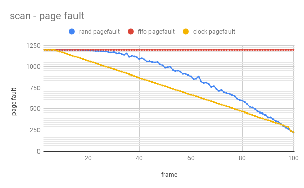
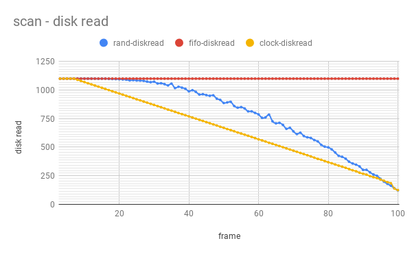
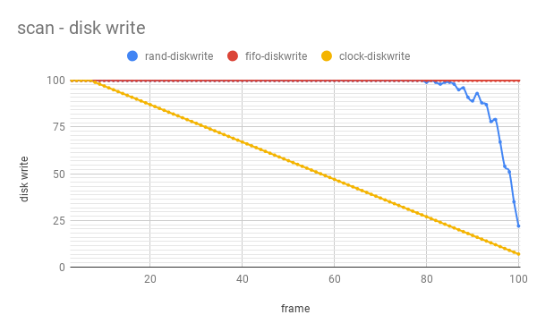
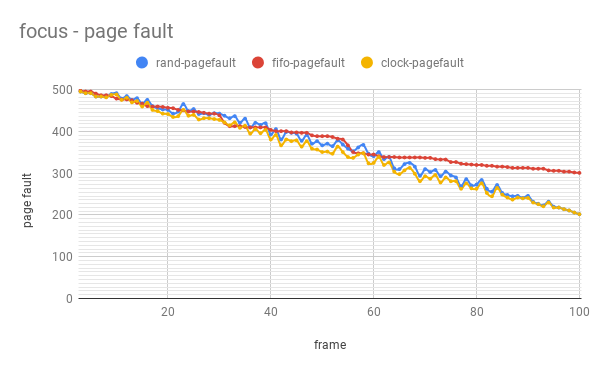
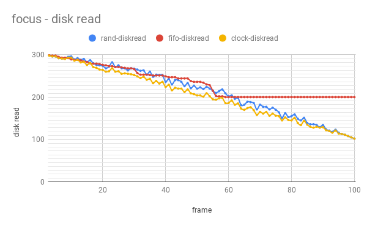
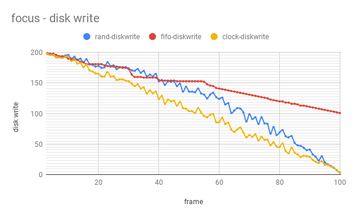
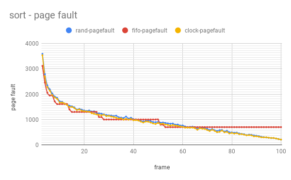
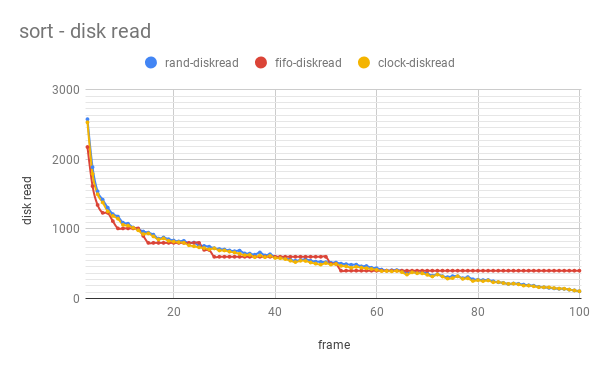
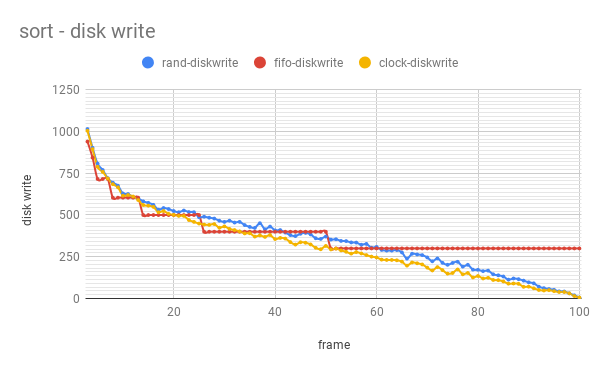

# Project 2: Virtual Memory

## Purpose of Experiments 

We did several experiments on different page replacement algorithms, including random replacement, first-in-first-out replacement and clock replacement (customized algorithm on our own) to estimate the performance of those algorithm over various benchmark programs (scan, sort and focus) in the situation where various sizes of frames are provided in the system. Then we could have a better comprehension of which algorithm would outperform the others in different situations. The measurement of performance in our experiments are the number of page faults, disk reads and disk writes, which could be used to estimate the system execution time over a program.  

## Expermental Setup  

We run our program in a Linux machine in Keller CSE Lab through SSH. The machine name is: csel-kh1250-05.cselabs.umn.edu.  

Command line used to run experiments:  
- make clean
- make
- ./evaluate.sh  
  
We use evaluate.sh to run the three programs using three different page replace algorithms with different _nframes_ (from 1 to 100).

## Custom Page Replace Algorithm : clock algorihtm  
We use a counter for each entry in physical memory and update it periodically, that is when a page fault occurs, the counters are updated. The larger the value of counter is, the longer the entry has not been accessed.  
Since each page in virtual memory has a bit to represent it is in read/write mode, we assume that the entry in physical memory with PROT_WRITE bit is accessed recently. So we scan entries in physical memory, increment couters of those with PROT_READ bits, zero counters of those with PROT_WRITE bits.  
Here is the code of update counters:  
``` c
void clock_cnt(struct page_table *pt){
	struct node *tmp = FL->head;
	for(int i = 0 ; i < (FL->nframes - FL->freeframes); i++){
		if(pt->page_bits[tmp->page] & PROT_WRITE){
			tmp->cnt = 0;
		}
		else{
			tmp->cnt++;
		}
		tmp = tmp->next;
	}
}
```  
How to decide which entry to evict? We set a threshold and if the value of counter exceed it, then the corresponding entry is a candidate to be evicted. When a page fault occurs and there is no room for a new page, we choose one of the candidates to evict. However, if there is no candidate at all, we can randomly choose one to evict which is exactly rand algorithm.
Here is the code of how to choose evict entry:  
``` c  
struct node* clock_node(){
	struct node* tmp = FL->head;
	struct node* evict_frame = FL->head;
	for(int i = 0; i < FL->nframes; i++){
		if(tmp->cnt >= THRESHOLD){
			evict_frame = tmp;
			return evict_frame;
		}
		tmp = tmp->next;
	}
	evict_frame = rand_node();
	return evict_frame;
}
```  
At first, we choose the entry with the largest value of counter as evicted one. However, it results in more than 10,000 times page faults when _nframes_ is less or equal to 50, and it outperforms _rand_ when the _nframes_ is large or equal to 51.

## Analysis of Results
### Scan  
Here are three graphs show the evaluation and comparison of the three replace algorithm in terms of page fault, disk read and disk write when run _scan_ program. _clock_ outperforms _fifo_ and _rand_ when _nframes_ is not too small. _scan_  simply write to the whole virtual memory and then read it for 10 times. 
- _fifo_ always evicts the first entered one. At first, the physical memory is empty, it definitely results in page faults like other two algorithm. But when scan the virtual memory again, there will be no reqired page in the physical memory. So when a page is required, a page fault occurs.
- _rand_ selects evict entry randomly, so there may maintain some required pages in physical memory.
- _clock_ approximates _LRU (Least Recently Used)_, it maintains good temporal locality.


<div align="center"></div>
<div align="center"></div>
<div align="center"></div>

## Focus  
Here are three graphs show the evaluation and comparison of the three replace algorithm in terms of page fault, disk read and disk write when run _focus_ program.  
_clock_ is comparable to _rand_ when _nframes_ is very small or close to _npages_, but outperforms _rand_ when _nframes_ is between 20 to 80. Because when physical memory is small, page faults occurs frequently which results in no counter reach threshold, and _clock_ is exactly _rand_. 

<div align="center"></div>
<div align="center"></div>
<div align="center"></div>

## Sort  
Here are three graphs show the evaluation and comparison of the three replace algorithm in terms of page fault, disk read and disk write when run _sort_ program. 


<div align="center"></div>
<div align="center"></div>
<div align="center"></div>

